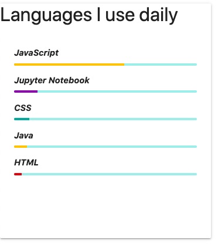

# GitHub-Language-Card

Card for the languages you use on GitHub. Can be used for your websites.


## How to use

1. Include the script in your page
```
<script src="https://sherwyn11.github.io/Github-Language-Card/languages.js"></script>
```

2. Add the <b>div</b> tag to your page
```
<div class="github-languages" username="<YOUR_GITHUB_USERNAME>" id="language-card"></div>
```


## Output



## License

[](https://opensource.org/licenses/MIT)

[MIT License Link](https://github.com/sherwyn11/GitHub-Language-Card/blob/master/LICENSE)

&copy; 2020 Sherwyn D'souza
